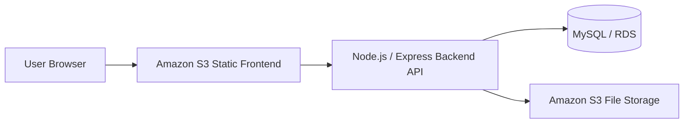
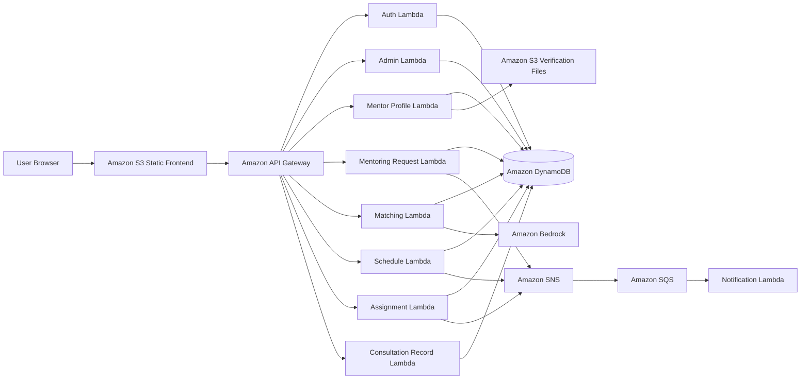
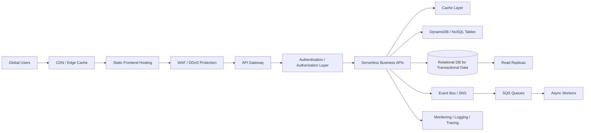

# AWS Mentoring Matching System

멘토링 신청, 멘토 프로필 관리, 관리자 배정, 일정 확정, 상담 기록 저장, 알림 처리를 지원하는 AWS 기반 멘토링 매칭 시스템입니다.  
KMU Cloud Computing 최종 프로젝트로, **V1 → V2 → Final Roadmap** 방식으로 아키텍처를 점진적으로 개선했습니다.

## 1. Project Overview

이 프로젝트의 목표는 처음부터 완성형 클라우드 구조를 만드는 것이 아니라, 먼저 최소 기능이 동작하는 시스템을 구현한 뒤, 그 한계를 분석하여 더 안정적이고 확장 가능한 AWS 아키텍처로 발전시키는 것입니다.

### Main Features

- User authentication and role-based access
- Mentor profile registration and management
- Mentee mentoring request creation
- Admin assignment and approval workflow
- Schedule confirmation and meeting link management
- Consultation record creation and lookup
- Event-based notification processing
- Embedding-based mentor matching logic

## 2. Architecture Evolution

| Version | Goal | Main Architecture | Key Point |
|---|---|---|---|
| V1 | Minimum working service | S3 frontend + Node.js/Express backend + MySQL/RDS-oriented structure | Implement required features first |
| V2 | Cloud-native improvement | S3 + API Gateway + multiple Lambda functions + DynamoDB + SNS/SQS + Bedrock | Separate functions and improve scalability |
| Final | 10M-user roadmap | CDN, cache, high availability, monitoring, security hardening | Large-scale service design roadmap |

## 3. Repository Structure

```text
.
├── v1/                         # Minimum infrastructure implementation
│   ├── backend/                 # Node.js / Express backend
│   ├── css/                     # Frontend styles
│   ├── js/                      # Frontend JavaScript
│   ├── index.html               # Frontend entry page
│   └── README.md
│
├── v2/                         # Serverless AWS implementation
│   ├── frontend/                # Static frontend
│   ├── auth_lambda/             # Authentication Lambda
│   ├── admin-lambda/            # Admin APIs
│   ├── mentor-profile-lambda/   # Mentor profile APIs
│   ├── mentoring-request-lambda/# Mentoring request APIs
│   ├── matching-lambda/         # Matching logic and embedding helper
│   ├── schedule-lambda/         # Schedule management APIs
│   ├── assignment-lambda/       # Assignment workflow APIs
│   ├── consultation-recode-lambda/ # Consultation record APIs
│   └── notification-lambda/     # Event-based notification worker
│
└── docs/
    ├── architecture.md          # Architecture diagrams and explanation
    └── presentation_summary.md  # Presentation summary
```

## 4. V1: Minimum Working Architecture

V1 focuses on implementing the required service features with the simplest practical infrastructure.



### V1 Design Intention

- Build a working mentoring system as quickly as possible.
- Verify the core service flow end-to-end.
- Implement authentication, mentoring requests, admin workflow, mentor profile, and consultation records.

### V1 Limitations

- Backend responsibilities are concentrated in one application.
- Notification and main request processing are not sufficiently separated.
- Scaling requires more backend runtime management.
- Increased traffic can put pressure on database connections and synchronous request handling.

## 5. V2: Cloud-Native Serverless Architecture

V2 improves the V1 limitations by separating backend features into AWS Lambda functions and using managed AWS services.



### Why API Gateway?

API Gateway provides a stable API entry point between the frontend and backend Lambda functions. This reduces frontend dependency on individual backend function URLs and makes routing and API management easier.

### Why Lambda Separation?

Each business capability is separated into an independent Lambda function. This makes the system easier to maintain, test, and scale by feature.

### Why SNS/SQS?

Notification processing does not need to block the main user request. SNS and SQS decouple event publishing and notification handling, improving responsiveness and reliability.

### Why DynamoDB?

DynamoDB is suitable for serverless access patterns such as user profiles, mentoring requests, schedules, and notification records. It reduces server management burden and supports scalable key-value/document-style access.

### Why Bedrock?

The matching Lambda includes embedding-based logic to support mentor candidate recommendation based on mentoring topics and profile information.

## 6. Final Roadmap for 10 Million Users

For a 10 million-user scale, the architecture should be extended beyond the current implementation.



### Roadmap Direction

- Use CDN and caching to reduce latency and database read load.
- Apply high availability with Multi-AZ and read replicas where needed.
- Separate transactional data, logs, notification history, and analytics data.
- Strengthen authentication, authorization, encryption, and audit logging.
- Monitor API latency, Lambda errors, queue backlog, and database capacity.

## 7. Tech Stack

### V1

- Frontend: HTML, CSS, JavaScript, Vite
- Backend: Node.js, Express
- Database: MySQL / RDS-oriented schema
- Storage: Amazon S3

### V2

- Frontend: HTML, CSS, JavaScript
- Backend: AWS Lambda, Python
- API: Amazon API Gateway
- Database: Amazon DynamoDB
- Event Processing: Amazon SNS, Amazon SQS
- AI Matching: Amazon Bedrock embedding logic
- Storage: Amazon S3

## 8. Security Note

Environment files and secret values are intentionally excluded from this repository.  
Use `.env.example` or AWS Lambda environment variables for configuration.

## 9. Portfolio Summary

This project demonstrates the process of evolving a cloud application from a minimum working implementation to a serverless AWS architecture.  
The main focus is not only on implementing features, but also on explaining architectural decisions such as API Gateway routing, Lambda separation, event-driven notification processing, and large-scale service roadmap design.
