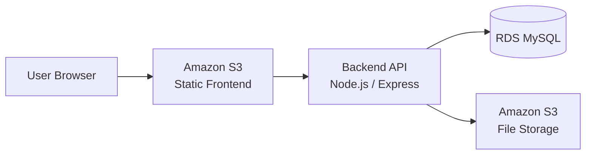
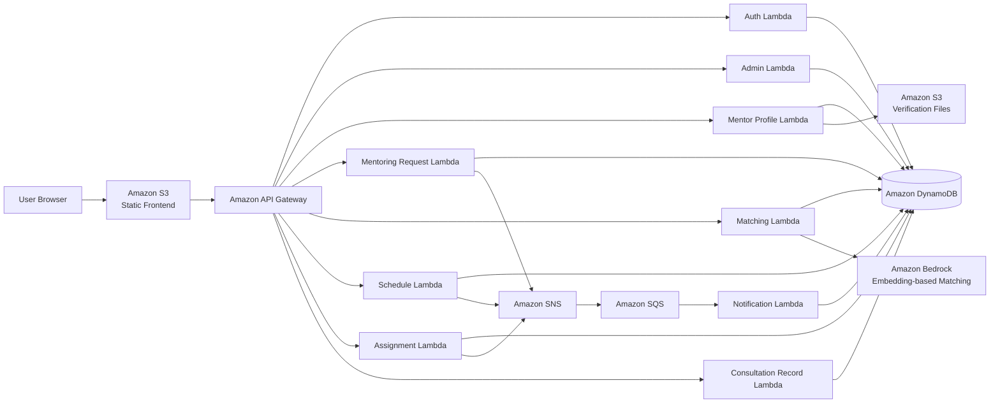
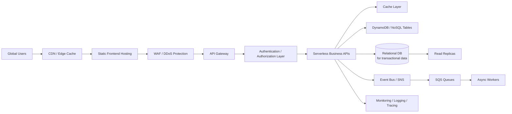

# Architecture Evolution

## V1: Minimum Working Architecture

### Purpose
V1 focuses on implementing the required mentoring matching and consultation record features with the smallest practical infrastructure.

### Limitation
- Backend responsibilities are concentrated in one application.
- Request processing is mostly synchronous.
- Scaling the backend requires managing the runtime environment.
- More traffic can increase database connection pressure.

## V2: Cloud-Native Serverless Architecture

### Improvement
- API Gateway provides a stable API entry point.
- Lambda functions are separated by business capability.
- SNS and SQS decouple notification/event processing.
- DynamoDB supports serverless data access for user/request-oriented workloads.
- Bedrock-based embedding logic supports mentor matching.

## Final Roadmap: 10 Million Users

### Roadmap Direction
- Add CDN and cache to reduce latency and repeated database reads.
- Apply Multi-AZ and read replicas for high availability.
- Separate transactional data, logs, notification history, and analytics data.
- Strengthen authentication, authorization, encryption, and audit logging.
- Monitor API latency, Lambda errors, queue backlog, and database capacity.
